# 🏛 FY:UM


### 1️⃣ 개요

> "모나리자를 보러 루브르 박물관까지? "
> 
> "전시회보러 서울까지 가기에는 너무 멀다...  "

우리나라는 대부분의 문화 예술 전시회들이 수도권에 편중되어 있어 지방에 거주하는 사람들은 시간적, 공간적 제약으로 인해 접근이 쉽지 않습니다. 실제로 2020년 국토교통부 조사에 따르면, 서울에서 문화공연시설은 2.08km 이내에서 접할 수 있는 반면, 강원도에서는 문화공연시설을 13.32km 안에서 찾을 수 있다고 합니다. 온라인으로라도 명화를 감상하려고 하면 실제 명화를 감상하는 느낌보다는 단순 사전처럼 정보 제공하는 서비스가 많습니다.  
FY:UM(피움) 서비스는 시공간에 구애 받지 않으면서도 실제로 미술관에 방문한 것처럼 현실감 있게 명화를 감상할 수 있고, 직접 나의 전시회를 열어 다른 사람들과 공유하는 서비스입니다. 저희 DOCENT는 FY:UM(피움) 서비스를 이용하는 누구든 문화 예술에 보다 쉽게 다가갈 수 있도록 돕고자 합니다.

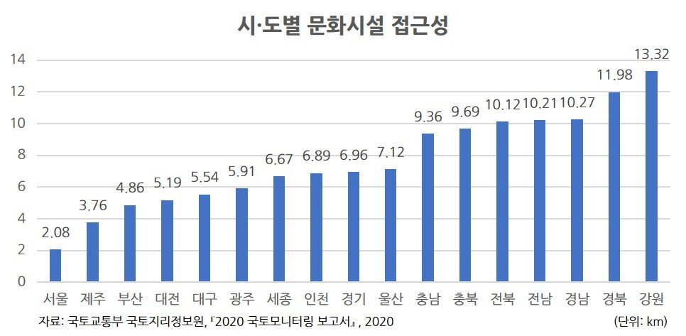

</br>

### 2️⃣ 개발기간

2023년 4월 10일 ~ 2023년 5월 19일 (총 6주)

</br>

### 3️⃣ 주요 기능

1. **명화 추천**
   
   - 회원가입과 동시에 진행되는 설문조사를 통해 나의 취향에 맞는 명화를 추천 받을 수 있습니다.
   
   - 마음에 드는 명화를 찜하면 명화 추천 목록이 갱신됩니다.

2. **명화 조회**
   
   * 작가별, 사조별, 테마별로 원하는 명화를 찾아서 감상할 수 있습니다. 
   
   * 작가, 사조에 대한 설명을 볼 수 있습니다.

3. **명화 상세 조회**
   
   * 명화의 상세한 정보를 볼 수 있습니다.
   
   * 버튼을 통해 상세정보를 on/off함으로써 더욱 생생하게 명화를 감상할 수 있습니다.
   
   * TTS 기능을 통해 명화를 감상하면서 설명을 들을 수 있습니다.
   
   * 찜하거나, 나만의 전시회에 추가할 수 있습니다.

4. **3D 전시회**
   
   * 내가 좋아하는 명화, 내가 직접 그린 그림, 내가 찍은 사진을 나만의 전시회 목록에 담아 unity로 구현된 온라인 3D 전시회에서 생생하게 감상할 수 있습니다.
   
   * 다른 사람들의 전시회에도 입장하여 명화를 감상하고, 채팅할 수 있습니다.
   
   * 전시회 속에는 큐레이터가 따라다니며 감상을 도와줍니다.

5. **나만의 갤러리**
   
   * 마이페이지와 같은 기능으로 명화 찜 목록 관리(Liked List), 나만의 전시회 목록 관리(Exhibition List), 그림 그리기(Drawing), 내가 그린 그림 목록 관리(My drawings)가 가능합니다.
   
   * 찜 목록 관리(Liked List)  : 명화 상세 정보에서 찜한 명화의 목록을 볼 수 있습니다.
   
   * 나만의 전시회 목록 관리(Exhibition List) : 명화 상세 정보에서 나만의 전시회에 담은 목록을 볼 수 있습니다.
   
   * 그림 그리기(Drawing) :  그림판에 직접 그림을 그릴 수도 있고, 내가 원하는 사진을 업로드해서 그림 위에 내가 직접 그림을 그려볼 수도 있습니다. 완료된 그림을 사이트에 업로드하거나, 기기에 저장할 수 있습니다.
   
   * 내가 그린 그림 관리(My drawings) : drawings에서 그린 그림을 관리할 수 있습니다.

### 4️⃣ 페이지별 소개

##### 1. Intro 페이지

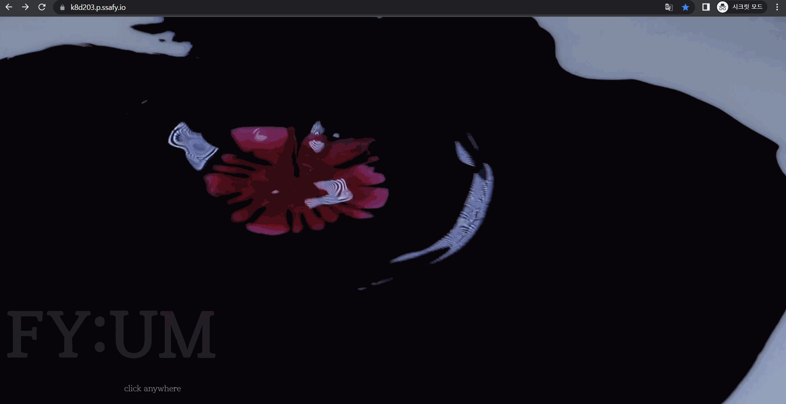

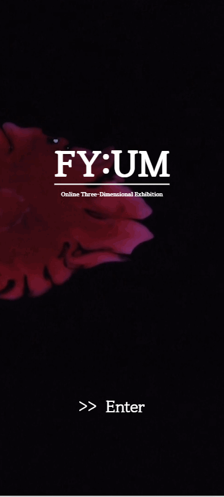

##### 2. Login 페이지

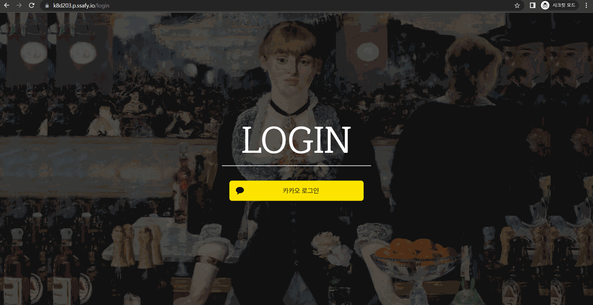

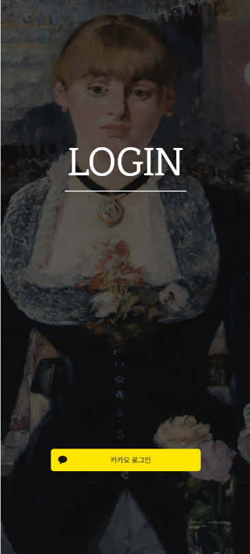

##### 3. Main & Menu 페이지


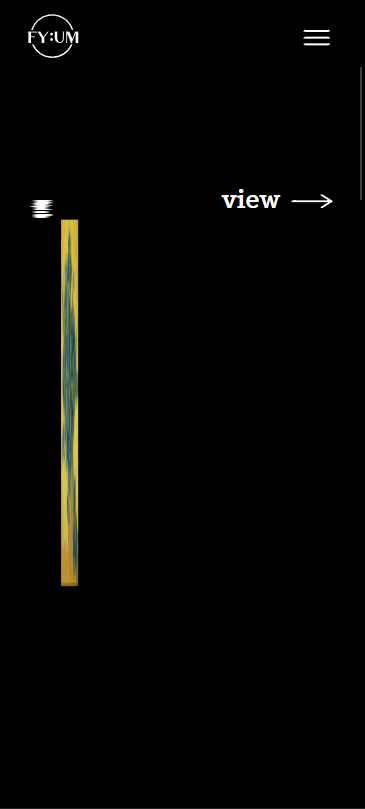

##### 4. Survey 페이지

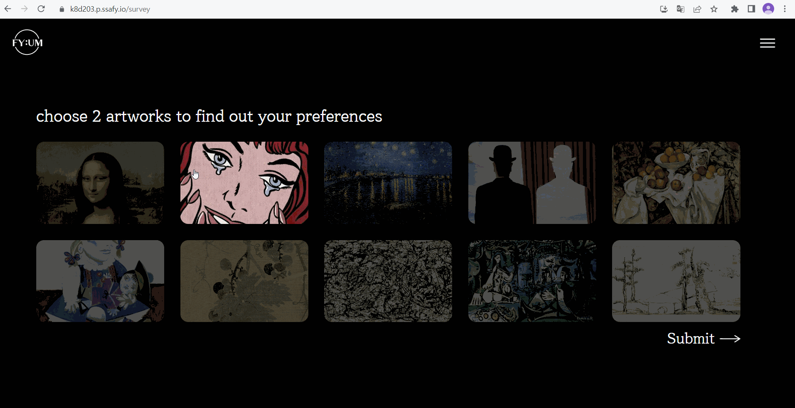

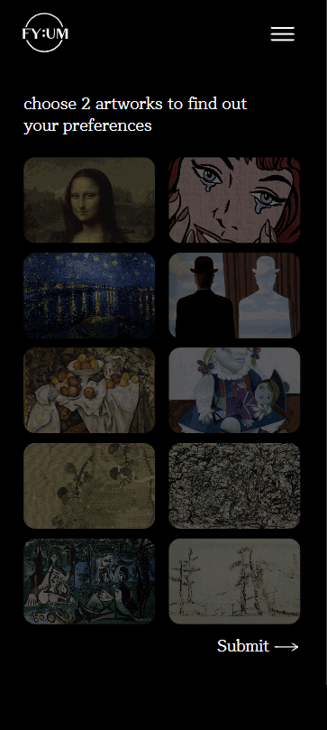

##### 5. Recommend List 페이지

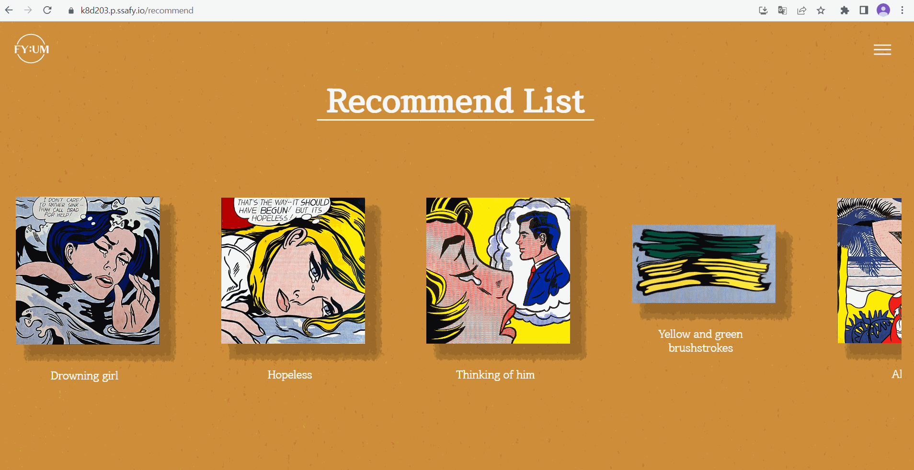

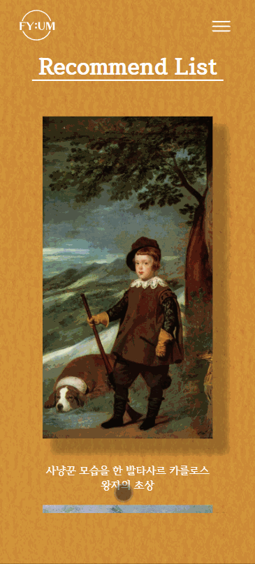

##### 6. Collection 페이지


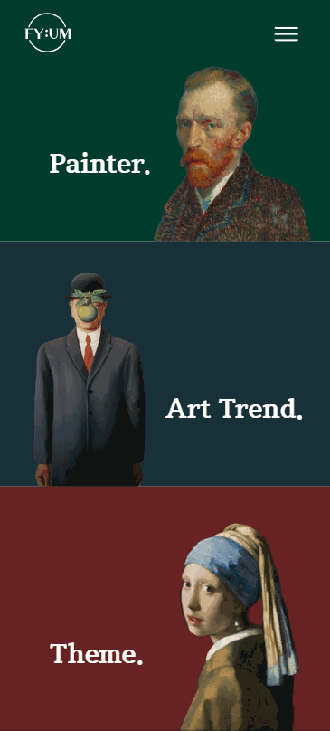

##### 7. Detail 페이지


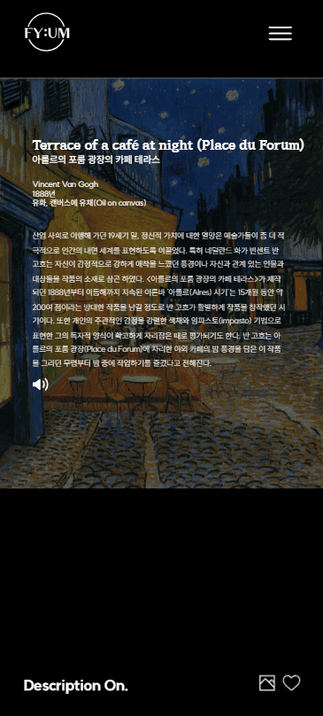

##### 8. Gallery 페이지 (Drawing, My Drawings)

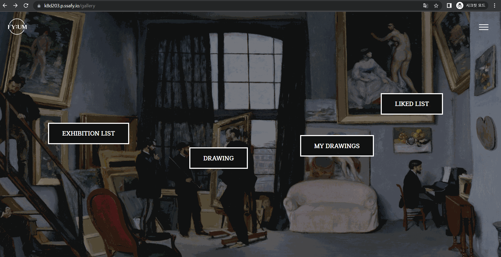

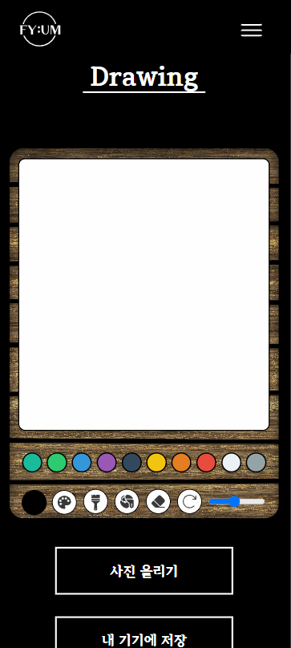

##### 9. Gallery 페이지 (Liked List)

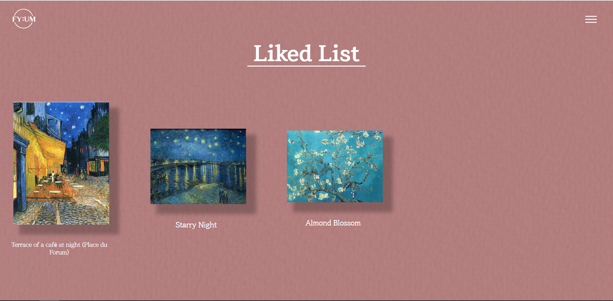

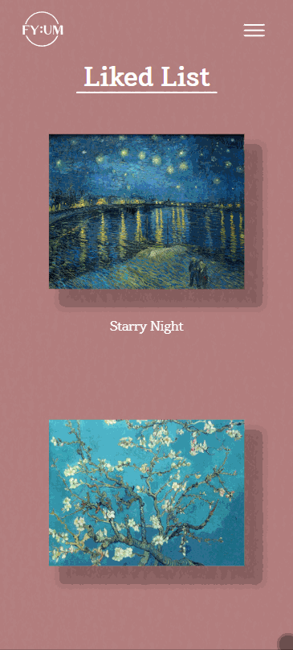

##### 10. Gallery 페이지 (Exhibition List)

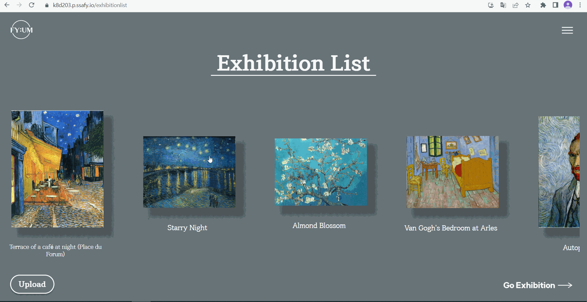

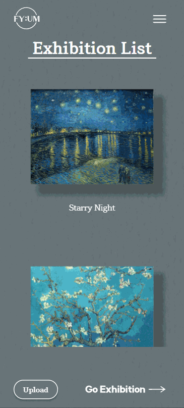

##### 11. 3D Collection 페이지


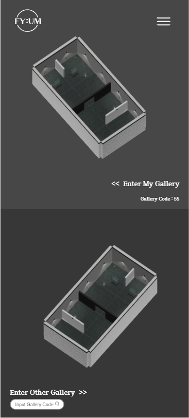

### 5️⃣ 팀원 소개

* 이동하(VR/팀장)

* 이아현(FE/팀원)

* 이지예(FE/팀원)

* 이해솜(FE/팀원)

* 임유정(BE/팀원)

* 조재완(BE/팀원)

### 

### 6️⃣ 기술 스택

* FE 
  
  * React.js
  
  * redux-toolkit
  
  * redux-saga
  
  * redux-persist
  
  * styled-components
  
  * unity

* BE
  
  * Springboot
  
  * Spring Data JPA
  
  * Spring Security
  
  * MariaDB
  
  * Django
  
  * Numpy
  
  * Pandas
  
  * Pyarrow

* VR
  
  * Unity 2019.4.18f
  
  * WebXr Export 0.16.0
  
  * WebXr Interactions 0.16.3
  
  * Oculus XR Plugin 1.6.1
  
  * VRTK v4 Tilia Package Importer 1.3
  
  * Tilia CameraRig TrackedAlias Unity 2.4.3
  
  * Tilia Indicators ObjectPointers Unity 2.2.3
  
  * Tilia Interactions Interactables Unity 2.16.2
  
  * Tilia Interaction PointerInteractors Unity 2.3.2
  
  * Tilia Locomotor AxisMove Unity 2.0.33
  
  * TextMeshPro 2.1.6
  
  * ExtendRealityLtd/Zinnia.Unity 2.12.1
  
  * Editor Coroutines 1.0.0
  
  * Visual Studio Code Editor 1.2.3
  
  * Unity UI 1.0.0
  
  * Photon Pun2 Plus 2.42

### 7️⃣ 시스템 아키텍처

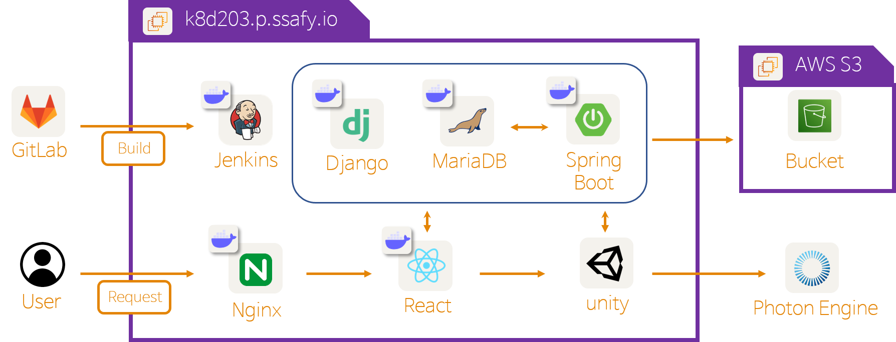

### 8️⃣ 기타 문서

##### < 와이어프레임 (Figma) >

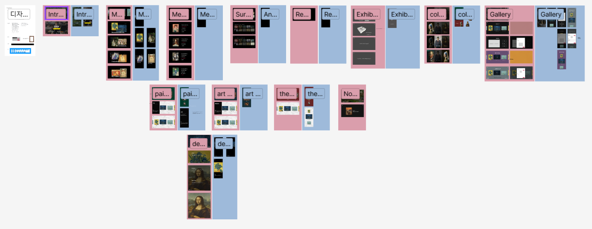

##### < API문서 >

[피움 API 문서](https://documenter.getpostman.com/view/27028863/2s93eU2ET7)

### 9️⃣ 프로젝트 구조

```
└─📂backend
└─📂frontend
└─📂pServer
└─📂unityProxy
```

<details>
<summary>Front-End</summary>
<div markdown="1">

```
📦src
 ┣ 📂assets
 ┃ ┣ 📂icon
 ┃ ┣ 📂images
 ┃ ┃ ┣ 📂survey
 ┃ ┗ 📂lottie
 ┣ 📂components
 ┃ ┣ 📂ArtList
 ┃ ┣ 📂auth
 ┃ ┣ 📂Collection
 ┃ ┣ 📂common
 ┃ ┃ ┣ 📂Btn
 ┃ ┃ ┣ 📂form
 ┃ ┃ ┣ 📂Header
 ┃ ┃ ┣ 📂Loading
 ┃ ┃ ┣ 📂Menu
 ┃ ┃ ┗ 📂Modal
 ┃ ┣ 📂Detail
 ┃ ┣ 📂Drawing
 ┃ ┣ 📂Exhibition
 ┃ ┣ 📂ExhibitionList
 ┃ ┣ 📂Intro
 ┃ ┣ 📂Liked
 ┃ ┣ 📂List
 ┃ ┣ 📂Main
 ┃ ┃ ┣ 📂Main1
 ┃ ┃ ┣ 📂Main2
 ┃ ┃ ┣ 📂Main3
 ┃ ┃ ┣ 📂Main4
 ┃ ┣ 📂MyDrawings
 ┃ ┣ 📂Recommend
 ┃ ┗ 📂utils
 ┣ 📂fonts
 ┣ 📂pages
 ┃ ┣ 📂ArtListPage
 ┃ ┣ 📂CollectionPage
 ┃ ┣ 📂DetailEtcPage
 ┃ ┣ 📂DetailPage
 ┃ ┣ 📂DrawingPage
 ┃ ┣ 📂ExhibitionListPage
 ┃ ┣ 📂ExhibitionPage
 ┃ ┣ 📂GalleryPage
 ┃ ┣ 📂IntroPage
 ┃ ┣ 📂LikedListPage
 ┃ ┣ 📂ListPage
 ┃ ┣ 📂LoginPage
 ┃ ┣ 📂MainPage
 ┃ ┣ 📂MyDrawingsPage
 ┃ ┣ 📂NotFoundPage
 ┃ ┣ 📂RecommendationPage
 ┃ ┣ 📂SurveyPage
 ┣ 📂store
 ┣ 📂styles
 ┣ 📜App.tsx
 ┣ 📜index.css
 ┣ 📜index.tsx
 ┗ 📜react-app-env.d.ts
```
</div>
</details>

<details>
<summary>Back-End</summary>
<div markdown="1">

```
│  └─src
│      ├─main
│           ├─java
│           │  └─com
│           │      └─example
│           │          └─fyum
│           │              ├─config
│           │              ├─exception
│           │              ├─exhibition
│           │              │  ├─controller
│           │              │  ├─dto
│           │              │  ├─entity
│           │              │  ├─repository
│           │              │  └─service
│           │              ├─masterpiece
│           │              │  ├─controller
│           │              │  ├─dto
│           │              │  ├─entity
│           │              │  ├─repository
│           │              │  └─service
│           │              ├─member
│           │              │  ├─controller
│           │              │  ├─dto
│           │              │  ├─entity
│           │              │  ├─repository
│           │              │  └─service
│           │              ├─myDrawing
│           │              │  ├─controller
│           │              │  ├─dto
│           │              │  ├─entity
│           │              │  ├─repository
│           │              │  └─service
│           │              ├─recommend
│           │              │  ├─controller
│           │              │  ├─dto
│           │              │  ├─entity
│           │              │  ├─repository
│           │              │  └─service
│           │              ├─utils
│           │              └─wishlist
│           │                  ├─controller
│           │                  ├─dto
│           │                  ├─entity
│           │                  ├─repository
│           │                  └─service
│           └─resources
```
</div>
</details>


<details>
<summary>pServer</summary>
<div markdown="1">

```
│  ├─recom
│  │  ├─migrations
│  │  └─source
│  └─recomProject
```
</div>
</details>

<details>
<summary>unityProxy</summary>
<div markdown="1">

```
    ├─gradle
    │  └─wrapper
    └─src
        ├─main
        │  ├─java
        │  │  └─com
        │  │      └─fyum
        │  │          └─proxy
        │  └─resources
        │      └─static
        └─test
            └─java
                └─com
                    └─fyum
                        └─proxy
```
</div>
</details>
